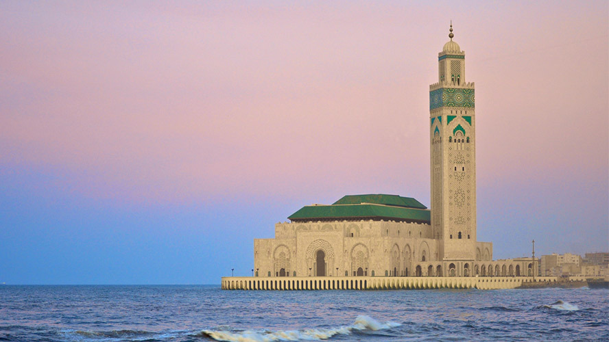
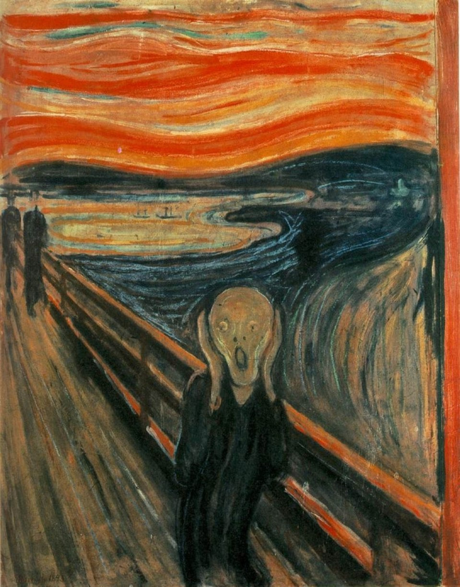
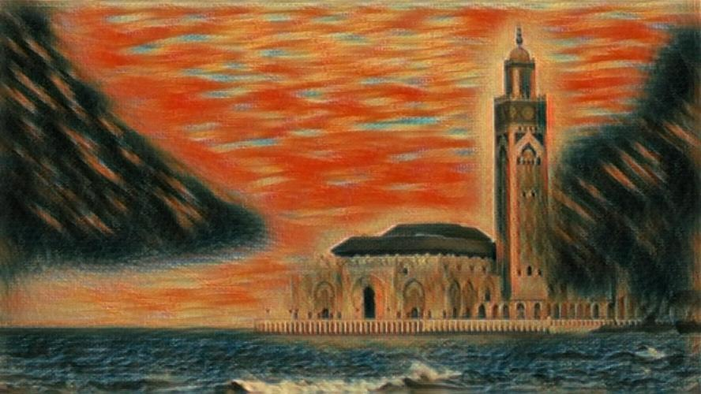
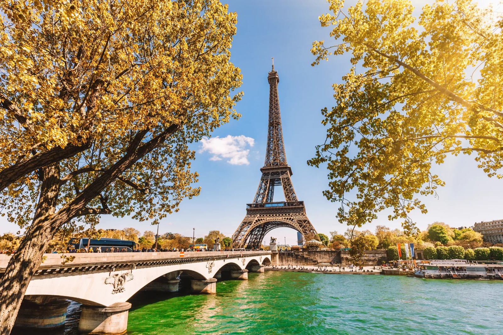
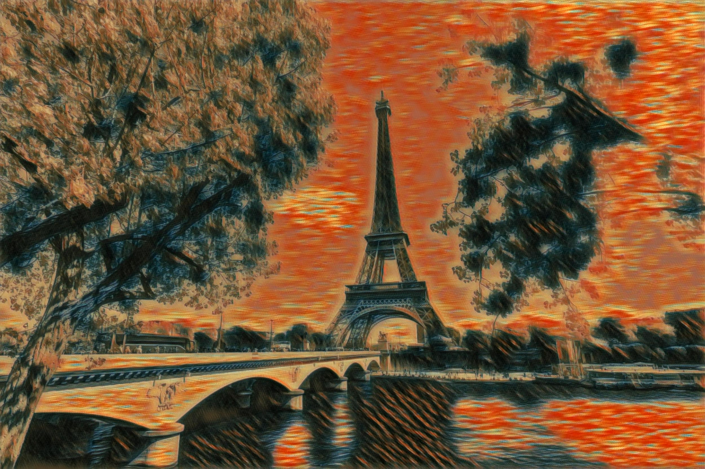

# Fast Style Transfer PyTorch

A PyTorch implementation of fast neural style transfer based on the papers:
- [Perceptual Losses for Real-Time Style Transfer and Super-Resolution](https://arxiv.org/abs/1603.08155)
- [Texture Networks_ Feed-forward Synthesis of Textures and Stylized Images](https://arxiv.org/abs/1603.03417)
- [Instance Normalization: The Missing Ingredient for Fast Stylization](https://arxiv.org/abs/1607.08022)

This implementation uses **Instance Normalization** instead of Batch Normalization for better stylization results.
<p align = 'center'>



</p>
<p align = 'center'>



</p>

## Requirements

```bash
pip install torch torchvision pillow numpy
```

## Usage

### Training

Train a new style transfer model:

```bash
python train.py train --dataset /path/to/coco/dataset \
                     --style-image /path/to/style/image.jpg \
                     --save-model-dir ./models \
                     --epochs 2 \
                     --batch-size 4 \
                     --save-model-dir /path/to/save_model_dir \
                     --checkpoint-model-dir /path/to/checkpoint \
                     --image-size 640 \
                     --style-size 900 \
                     --content-weight 10 \
                     --style-weight 1000 \
                     --lr 1e-3 \
                     --cuda 1
```

### Stylization

Apply a trained model to stylize an image:

```bash
python train.py eval --content-image /path/to/content/image.jpg \
                    --model ./models/trained_model.pth \
                    --output-image ./output.jpg \
                    --cuda 1
```

## Model Architecture

- **Transform Network**: Encoder-decoder architecture with residual blocks and instance normalization
- **Loss Network**: Pre-trained VGG19 for perceptual losses
- **Instance Normalization**: Applied after each convolutional layer
- **Residual Connections**: 5 residual blocks in the bottleneck

## Training Details

- **Content Loss**: Computed using VGG19 relu4_2 features
- **Style Loss**: Computed using Gram matrices from multiple VGG19 layers
- **Optimizer**: Adam with learning rate 1e-3
- **Image Size**: 640 during training

## Dataset

For training, you'll need:
- **Only a small dataset of images** I used 2000 images of coco dataset
- **Style images** (paintings/artistic images)

Download MS COCO:
```bash
wget http://images.cocodataset.org/zips/test2014.zip
unzip test2014.zip
```

## Results

The trained models can stylize images in real-time while preserving content structure and applying artistic style effectively.

## References

- [Lengstrom implementation](https://github.com/lengstrom/fast-style-transfer)


## License

This implementation is for research and educational purposes.
